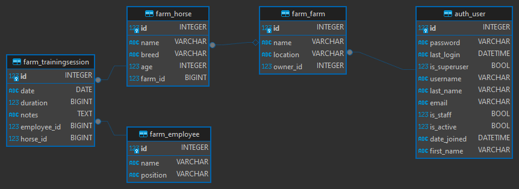

# web

## Índice

* [Introdução](#introdução)
* [Recursos Utilizados](#recursos-utilizados)
    * [Linguagens](#linguagens)
    * [Framework](#framework)
* [Sobre o Projeto](#sobre-o-projeto)
    * [Objetivo](#objetivo)
    * [Funcionalidades Principais](#funcionalidades-principais)
    * [Público-Alvo](#público-alvo)
    * [Benefícios](#benefícios)
    * [Diagrama Entidade-Relacionamento (DER)](#diagrama-entidade-relacionamento-der)
* [Execução do Projeto](#execução-do-projeto)
    * [Requisitos](#requisitos)
    * [Clone o repositório](#clone-o-repositório)
    * [Instalando o Python](#instalando-o-python)
    * [Instalando o Pip](#instalando-o-pip)
    * [Instalando o Ambiente Virtual](#instalando-o-ambiente-virtual)
    * [Criando o Ambiente Virtual](#criando-o-ambiente-virtual)
    * [Ativando o Ambiente Virtual](#ativando-o-ambiente-virtual)
    * [Instalando as Dependências](#instalando-as-dependências)
    * [Execute as migrações](#execute-as-migrações)
    * [Crie um superusuário para acessar o admin](#crie-um-superusuário-para-acessar-o-admin)
    * [Executando o Projeto](#executando-o-projeto)
* [Créditos](#créditos)

# Sistema de Gestão de Fazendas de Cavalos

## Introdução
Este projeto é um sistema de gestão de fazendas de cavalos desenvolvido com Django. O sistema permite gerenciar: 

* fazendas de cavalos.
  
* empregados.
  
* sessões de treinamento.

## Recursos Utilizados

A seguir estão listados os principais recursos utilizados no desenvolvimento deste trabalho.

### Linguagens

* [Python](https://www.python.org/) - Linguagem de Programação Principal
* HTML - Estrutura da Página Web
* CSS - Apresentação da Página Web
* [SQLite](https://www.sqlite.org/) - Sistema de Gerenciamento de Banco de Dados

### Framework

* [Django](https://www.djangoproject.com/) - Framework Web
* [Bootstrap](https://getbootstrap.com/) - Framework CSS

## Sobre o Projeto

### Objetivo
O objetivo deste projeto é desenvolver uma aplicação web para o gerenciamento de fazendas de cavalos. A aplicação permite o cadastro de fazendas, funcionários e seus cavalos, para que sejam gerenciados de maneira eficiente. Além disso, o sistema facilita o agendamento e o acompanhamento das sessões de treinamento dos cavalos.

### Funcionalidades Principais:
1. Gestão de Fazendas:
    - Cadastro e visualização de fazendas.

2. Gestão de Equinos:
    - Cadastro e visualização de cavalos.
    - Associação de cavalos a fazendas específicas.
    - Registro de informações como nome, raça e idade dos cavalos.

3. Gestão de Empregados:
    - Cadastro e visualização de empregados.
    - Registro de informações como nome e posição dos empregados.

4. Sessões de Treinamento:
    - Registro de sessões de treinamento para cavalos.
    - Associação de sessões de treinamento a cavalos e empregados.
    - Registro de informações como data, duração e notas sobre a sessão.

5. Autenticação e Autorização:
    - Login e autenticação de usuários.
    - Restrição de acesso a páginas protegidas por login/senha.

6. Ambiente Administrativo:
    - Utilização do Django Admin para gestão de todas as entidades do sistema.

7. Interface de Usuário:
    - Interface amigável e responsiva utilizando Bootstrap.

### Público-Alvo:
O sistema é destinado a proprietários de fazendas de cavalos, gerentes e treinadores que necessitam de uma solução eficiente para gerenciar suas operações diárias, incluindo o cadastro e acompanhamento de cavalos, empregados e sessões de treinamento.

### Benefícios:
- Melhoria na organização e gestão das fazendas de cavalos.
- Facilidade no acompanhamento das atividades de treinamento.
- Segurança e controle de acesso com autenticação de usuários.

### Diagrama Entidade-Relacionamento (DER)
O diagrama entidade-relacionamento (DER) do sistema é apresentado abaixo:



## Execução do Projeto

### Requisitos
- Python 3.x
- Django 4.2.x
- Django-bootstrap 24.3

### Clone o repositório:

```bash
git clone https://github.com/vitor-tenorio/web.git
```

```bash
cd web
```

### Instalando o Python

Se necessário, instale o Python (testado na versão 3.8.8) [link](https://www.python.org/downloads/).

Verifique a versão instalada do Python (para ter certeza que tudo ocorreu bem):

```bash
python --version
```

### Instalando o Pip

Se necessário, instale o pip (testado na versão 24.1):

```bash
sudo apt install python3-pip
```

Verifique a versão instalada do pip (para ter certeza que tudo ocorreu bem):

```bash
pip3 --version
```

### Instalando o Ambiente Virtual
Se necessário, instale o virtualenv (testado na versão 20.26):

```bash
pip install virtualenv
```

### Criando o Ambiente Virtual

Crie o ambiente virtual (venv) para isolar as instalações/dependências do Python:

```bash
 virtualenv venv
```

**OBS:** no comando acima, o segundo nome `venv` é o nome que escolhemos para o nosso ambiente virtual (isso pode ser alterado).

### Ativando o Ambiente Virtual

Ative o ambiente virtual (venv) no seu computador utilizando o comando abaixo:

**Sistema Operacional:** Unix/macOS

```bash
source venv/bin/activate
```

**Sistema Operacional:** Windows

```bash
venv/Scripts/Activate     
```

Quando desejar sair do ambiente virtual, basta digitar:

```bash
deactivate
```

### Instalando as Dependências

Instale as dependências do projeto com o comando abaixo:

```bash
pip install -r Requirements.txt
```
### Execute as migrações:

Se necessário, execute as migrações do banco de dados:

```bash
python horse_farm_management\manage.py migrate
```

### Crie um superusuário para acessar o admin:
```bash
python manage.py createsuperuser
```

### Executando o Projeto

Inicie a execução do projeto django criado utilizando o comando abaixo:

```bash
python horse_farm_management\manage.py runserver
```

## Créditos
Projeto desenvolvido por: 
- Luís Fernando Santos Ferreira
- Jonathas Luis de Sousa
- Vitor André de Oliveira Tenório
